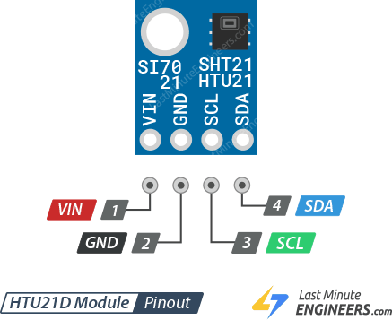
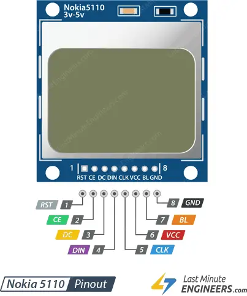

# RORU.SmartHome

This is Pet-project for building SmartHome Components by using [nanoframework](https://docs.nanoframework.net/index.html).

## Hardware

|Device|Pinout|Datasheet|
|---|---|---|
|ESP32-WROOM-32||
|SHT21 (HTU21)||[HTU21 Datasheet](./datasheets/HTU21D.PDF)|
|Pcd8544 (Nokia Module)||[Nokia Module Datasheet](./datasheets/Nokia5110.pdf)|

## Pin wiring

**SHT21 (HTU21)**
|ESP32-WROOM-32|SHT21|
|---|---|
|GPIO21 (I2C1_DATA)|SDA|
|GPIO22 (I2C1_CLOCK)|SCL|
|3V3|VIN|
|GND|GND|

**PCD8544 (Nokia Module)**
|ESP32-WROOM-32|PCD8544|
|---|---|
|GPI19|RST (1)|
|GPIO5 (VSPI_CS0)|CE (2)|
|GPIO4|DC (3)|
|GPI23 (VSPI_MOSI)|DIN (4)|
|GPRIO18 (VSPI_CLK)|CLK (5)|
|3V3|VCC (6)|
|3V3 + 220om resistor|BL (7)|
|GND|GND (8)|